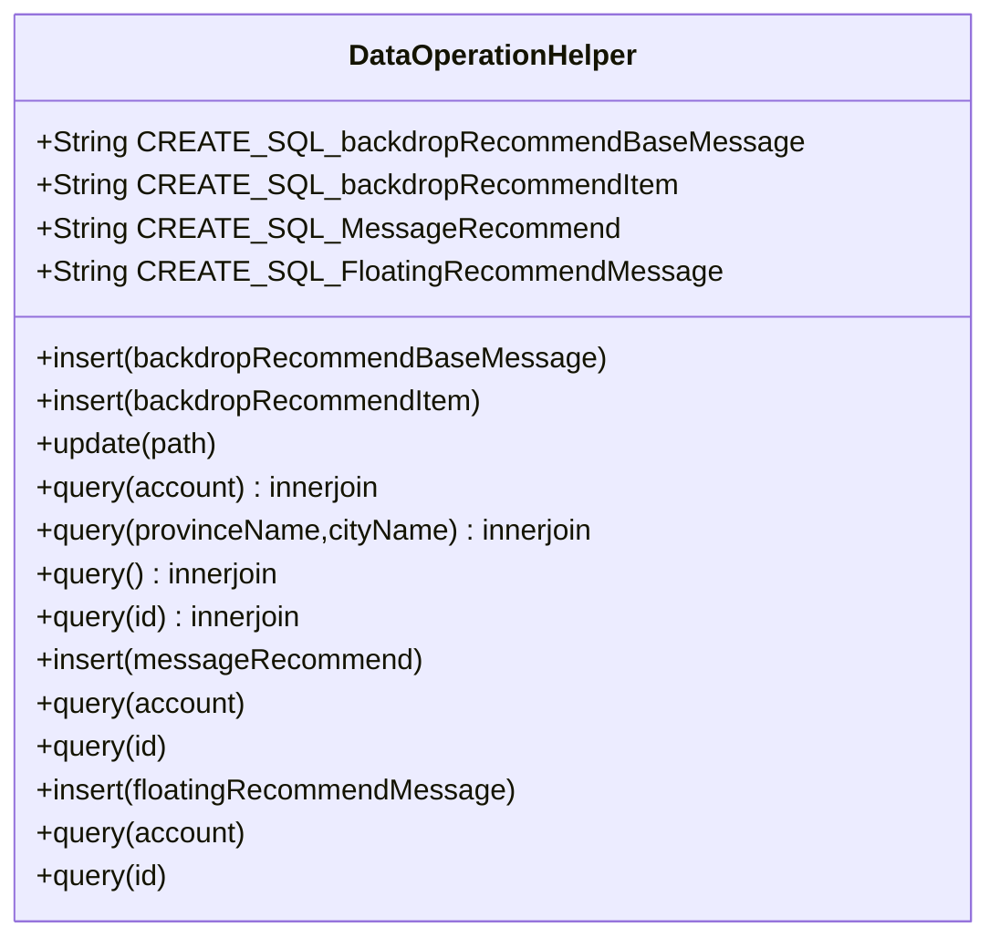

## 华人运通

```shell
repo init -u ssh://yuanqing.meng_a@192.168.111.203:29418/hht/aosp/platform/manifest -b gin-dev
repo init -u ssh://yuanqing.meng_a@10.18.32.32:29418/aosp/platform/manifest -b gin-dev --no-repo-verify
repo sync -c --no-tags -j1
```

### 使用makefile源码编译导入AndoridStudio

```shell
需要安装各种包，打开根目录全粘进去会全部执行需要输入“Y”的输入Y即可
sudo apt-get install -y vim
sudo apt-get install -y doxygen
sudo apt-get install -y valgrind
sudo apt-get install -y cscope
sudo apt-get install -y exuberant-ctags
sudo apt-get install -y gdb
sudo apt-get install -y strace
sudo apt-get install -y gcc
sudo apt-get install -y g++
sudo apt-get install -y subversion
sudo apt-get install -y git
sudo apt-get install -y git-svn
sudo apt-get install –y git
sudo apt-get install -y gnupgas
sudo apt-get install -y flex
sudo apt-get install -y bison
sudo apt-get install -y gperf
sudo apt-get install -y build-essential
sudo apt-get install -y zip
sudo apt-get install -y curl
sudo apt-get install -y libc6-dev
sudo apt-get install -y libncurses5-dev
sudo apt-get install -y x11proto-core-dev
sudo apt-get install -y libx11-dev
sudo apt-get install -y libreadline6-dev
sudo apt-get install -y libgl1-mesa-glx
sudo apt-get install -y libcheese-gtk23
sudo apt-get install -y libcheese7
sudo apt-get install -y libclutter-1.0-0
sudo apt-get install -y libgl1-mesa-dev
sudo apt-get install -y g++-multilib
sudo apt-get install -y mingw32
sudo apt-get install -y tofrodos
sudo apt-get install -y python-markdown
sudo apt-get install -y libxml2-utils
sudo apt-get install -y xsltproc
sudo apt-get install -y zlib1g-dev
sudo apt-get install -y uboot-mkimage
sudo apt-get install -y u-boot-tools:i386
sudo apt-get install -y u-boot-tools
sudo apt-get install -y zlib1g-dev:i386Stub.asInterface
sudo ln -s /usr/lib/i386-linux-gnu/mesa/libGL.so.1 /usr/lib/i386-linux-gnu/libGL.so
sudo apt-get install git-core gnupg flex bison gperf build-essential zip curl
sudo apt-get install libc6-dev libncurses5-dev:i386 x11proto-core-dev
sudo apt-get install libx11-dev:i386 libreadline6-dev:i386 libgl1-mesa-glx-lts-quantal:i386 g++-multilib
sudo apt-get install libx11-dev:i386
sudo apt-get install libreadline6-dev:i386
sudo apt-get install llibgl1-mesa-glx-lts-quantal:i386
sudo apt-get install g++-multilib mingw32 openjdk-6-jdk tofrodos python-markdown libxml2-utils xsltproc zlib1g-dev:i386 libxext-dev:i386 libswitch-perl
sudo apt-get install libgl1-mesa-dev
sudo apt-get install libgl1-mesa-glx
sudo apt-get install libcheese-gtk23
sudo apt-get install libcheese7
sudo apt-get install libclutter-1.0-0
sudo apt-get install uuid uuid-dev
sudo apt-get install zlib1g-dev liblz-dev
sudo apt-get install liblzo2-2 liblzo2-dev
sudo apt-get install tftpd tftp openbsd-inetd
sudo apt-get install openssl
sudo apt-get install libssl-dev

cd 自己项目文件夹名称/LINUX/android
$ source build/envsetup.sh
$ lunch
$ 17
$ export LC_ALL=C
如果不执行export LC_ALL=C 报FAILED: /home/yoona/lineage/out/target/product/x2/obj/STATIC_LIBRARIES/libedify_intermediates/lexer.cpp
执行如上命令会去除所有本地化设置make完之后需要设置回来 export LANG="zh_CN,UT-F8"
$ make
如果制定编译哪个模块，直接在make后跟模块名就可以了
$ mmm development/tools/idegen/
$ development/tools/idegen/idegen.sh
根目录生成如下：用AndroidStudio打开android.ipr即可
android.ipr (IntelliJ / Android Studio)
android.iml (IntelliJ / Android Studio)
带 $ 都需要执行
```

### 编译单个模块

修改mk文件

```makefile
# 混淆的概念是指通过一些工具，对函数名、变量名、类名，字段进行重命名。
# 取消java混淆
LOCAL_PROGUARD_ENABLED := disabled
# LOCAL_PROGUARD_FLAG_FILES := proguard.flags
# 出现如下问题FAILED: out/target/common/obj/APPS/BtPhone_intermediates/with-local/classes.dex
# 方法数量过多实现自动分包
LOCAL_DX_FLAGS := --multi-dex
# 不进行预先优化,如果为true每次不会生成新的apk
LOCAL_DEX_PREOPT := false
```

如不知道打包名可看mk文件

```makefile
# 出现ninja: error: unknown target 'BtCall', did you mean '-Wall'?
# 可看打包名字是否正确
LOCAL_PACKAGE_NAME := BtPhone、
make BtPhone
```

编译成功生产apk路径如下Install: out/target/product/gin/vendor/app/BtPhone/BtPhone.apk

adb root

adb remount

adb push 路径即可push到车机上

如果无法push成功可以使用

```shell
adb disable-verity //关闭检测功能
重启后好用
```

### 板子烧写流程

1.关闭电源调到fastboot模式下，使用笔拨动"ALPS"按键“2”到左边。正常情况下0011，fastboot模式为0111
2.烧机文件解压后，将fastboot.sh放入该目录下。
3.目录下终端打开，输入chmod u+x fastboot.sh先获取权限，再执行./fastboot.sh运行脚本。
4.结束后关闭电源，将板子模式调回，使用笔拨动"ALPS"按键“2”到右边，拨到0011再开起电源。
5.执行adb shell pm enable com.hryt.engineermode/.activity.EngineerModeActivity解除工程模式
6.如失败执行adb root
7.之后执行adb shell am start com.hryt.engineermode/.activity.EngineerModeActivity
8.使用投屏软件开启，进入工程模式后，点击关闭激活完成

### 开启工程模式

```shell
adb root
# 如果不开启 root 会报没有权限
adb shell am broadcast -a com.hryt.desktop.SHOW_OR_HIDE_OTHER_APP
```

### 地图激活

长按地图设置-更多设置-版本号

```shell
adb shell input text "QXMHEF4E9UGFWE6Y3E3ZD7YC"
adb shell input text "7E6TUJ2Y2RJUE7USCA676KY3"
adb shell input text "HRYT2000TEST00003000000000000000"
```

### 设置用户登录

```shell
调整网络环境
adb shell am broadcast -a com.hryt.desktop.SHOW_OR_HIDE_OTHER_APP
过了十几秒APPList第二页出现工程模式;
点左侧网络环境;
切到网络环境：DEV环境;
可能需要再重启一下；
重启后，把老的VIN和SN设上。
adb shell HHTConfigClient sc/GT/VIN OTH20210107000002
adb shell HHTConfigClient sc/GT/SN OTHSN20210107002

adb shell sh data/account/easy_account.sh -c
```

### 提代码问题

```shell
# 更改email即可
vim ~/.gitconfig
# 生产sshkey
ssh-keygen
# 选中添加到代码gerrit的SSHkeys中
cat .ssh/id_rsa.pub
# 拉代码如果email冲突重新执行如下命令，该命令会重新修改上一笔的提交，以及修改上一笔的commitmessage
git commit --amend
# 回滚到之前版本，版本号通过git log 去获取
git reset --soft 4e4212d0e5338cfd35d5c865fb13a47b1c501b28
```

### 发送静态广播用于测试

* 用于使用adb发送静态广播-f用于发送需要标记的广播，-a是定义的action --es 用于发送广播参数类型为String --i 用于发送int类型

```shell
adb shell am broadcast -a ACTION -f 0x00800000 -f 0x01000000 --es INFO "req_play_pause_set" --ei DATA 1 --es REQ "Test"
adb shell am broadcast -a ACTON -f 0x00800000 -f 0x01000000 --ei DATA 1
adb shell am broadcast -a com.seres.adapter.mock --es KEY "ID_PULSE_WHEEL_FL" --es DATA "123" --ez SUPPORT true
```

* AndroidMainFest.xml

```xml
<receiver
          android:name=".NotificationService$NotifyBroadcastReceiver"
          android:enabled="true"
          android:exported="true">
    <intent-filter>
        <action android:name="ACTION"/>
    </intent-filter>
</receiver>
```

* 定义广播内部类，发送静态广播必须得是static修饰的类，并且必须是public修饰，private无法实例化广播接收器

```java
public static class NotifyBroadcastReceiver extends BroadcastReceiver {
    @Override
    public void onReceive(Context context, Intent intent) {
        String info = intent.getStringExtra("INFO");
        String data = intent.getStringExtra("DATA");
        Log.d(TAG, "onReceive: ");
        mNotificationSignalManager.notifySignalChanged(info, data);
    }
}
```

### 在开发与硬件交互信号量时如何调试

1.刷了今天的vb,

2.adb remount

3.将/vendor/bin/HHTVCSService改名，比如/vendor/bin/HHTVCSService_mock

如果提示read-only则需要执行

```shell
adb disable-verity //关闭检测功能
重启后好用
```

使用如下命令修改文件夹名称

```shell
mv HHTVCSService HHTVCSService_mock
```

4.然后kill 正在跑的HHTVCSService
5.然后运行./HHTVCSService_mock -mock
6.此时可以输入命令r回车 , 输入对应的信号比如：PT_MileageChangeReminderType回车，然后根据提示继续输入取值，比如１回车，此时就模拟了信号上发了，其他功能都是类似的方法

### 命令行看Log

adb logcat | grep -E "UsbMusicFragment|UsbMusicService|UsbMusicModel|UsbMusicServiceManager"

adb logcat |grep -ie audiohal

### VPN安装

```shell
chmod 777 secoclient-linux-64-7.0.2.31.run
sudo ./secoclient-linux-64-7.0.2.31.run
sudo chmod 777 /etc/hosts
sudo apt-get install vim-gtk
vim /etc/hosts
使用命令i将如下内容拷贝到最后一行
10.18.20.68  jira.human-horizons.com
10.18.20.67  confluence.human-horizons.com
10.18.20.82  networkdisk.human-horizons.com
10.18.20.112 ofs.human-horizons.com
使用命令:wq!保存。使用VPN前提下即可访问jira
使用如下账号即可登录VPN，密码均为Qwe@1234⁣
远程网关地址：211.95.118.99端口号：9443
```

## 遥控器测试命令

```shell
播放
adb shell am broadcast -a ACTION -f 0x00800000 -f 0x01000000 --es INFO "req_play_pause_set" --ei DATA 1 --es REQ "Test"
暂停
adb shell am broadcast -a ACTION -f 0x00800000 -f 0x01000000 --es INFO "req_play_pause_set" --ei DATA 2 --es REQ "Test"
音量增加
adb shell am broadcast -a ACTION -f 0x00800000 -f 0x01000000 --es INFO "req_media_volume_change" --ei DATA 3 --es REQ "Test"
音量减少
adb shell am broadcast -a ACTION -f 0x00800000 -f 0x01000000 --es INFO "req_media_volume_change" --ei DATA 4 --es REQ "Test"
获取状态
adb shell am broadcast -a ACTION -f 0x00800000 -f 0x01000000 --es INFO "req_play_pause_get" --es REQ "Test"
上一曲
adb shell am broadcast -a ACTION -f 0x00800000 -f 0x01000000 --es INFO "req_pre" --es REQ "Test"
下一曲
adb shell am broadcast -a ACTION -f 0x00800000 -f 0x01000000 --es INFO "req_next" --es REQ "Test"
快进开始
adb shell am broadcast -a ACTION -f 0x00800000 -f 0x01000000 --es INFO "req_next_long_press_begin" --es REQ "Test"
快进结束
adb shell am broadcast -a ACTION -f 0x00800000 -f 0x01000000 --es INFO "req_next_long_press_end" --es REQ "Test"
快退开始
adb shell am broadcast -a ACTION -f 0x00800000 -f 0x01000000 --es INFO "req_pre_long_press_begin" --es REQ "Test"
快退结束
adb shell am broadcast -a ACTION -f 0x00800000 -f 0x01000000 --es INFO "req_pre_long_press_end" --es REQ "Test"
```

sounds：

```shell
adb shell am broadcast -a ACTION -f 0x00800000 -f 0x01000000 --es INFO "req_mute_type_set" --ei DATA 1 --es REQ "Test"

adb shell am broadcast -a ACTION -f 0x00800000 -f 0x01000000 --es INFO "req_mute_type_get" --es REQ "Test"

adb shell am broadcast -a ACTION -f 0x00800000 -f 0x01000000 --es INFO "req_media_volume_set" --ei DATA 3 --es REQ "Test"

adb shell am broadcast -a ACTION -f 0x00800000 -f 0x01000000 --es INFO "req_media_volume_get" --es REQ "Test"

adb shell am broadcast -a ACTION -f 0x00800000 -f 0x01000000 --es INFO "req_equalizer_set" --ei DATA 4 --es REQ "Test"

adb shell am broadcast -a ACTION -f 0x00800000 -f 0x01000000 --es INFO "req_equalizer_get" --es REQ "Test"

adb shell am broadcast -a ACTION -f 0x00800000 -f 0x01000000 --es INFO "req_cus_equalizer_set" --ei DATA 5 --es REQ "Test"

adb shell am broadcast -a ACTION -f 0x00800000 -f 0x01000000 --es INFO "req_cus_equalizer_get" --es REQ "Test"
```

## 遥控器测试类

```java
public static GwMediaService service;
public boolean isAppProcess() {
    String processName = getOlMusicProcess();
    return processName != null && processName.equalsIgnoreCase(this.getPackageName());
}
onCreate方法
if (isAppProcess()) {
    Intent bindIntent = new Intent(this, GwMediaService.class);
    bindService(bindIntent, serviceConnection, BIND_AUTO_CREATE);
}

public static class NotifyBroadcastReceiver extends BroadcastReceiver {
    @Override
    public void onReceive(Context context, Intent intent) {
        String info = intent.getStringExtra("INFO");
        int num = intent.getIntExtra("DATA", 1);
        String data = null;
        switch (num) {
            case 1:
                data = "{\"play\": \"true\"}";
                break;
            case 2:
                data = "{\"play\": \"false\"}";
                break;
            case 3:
                data = "{\"up\": \"true\"}";
                break;
            case 4:
                data = "{\"up\": \"false\"}";
                break;
            default:
                break;
        }
        String req = intent.getStringExtra("REQ");
        com.hryt.opensdk.utils.LogUtil.debug("GwMediaService" + "\n" + data + info + req);
        service.remoteControl(info, data, req);
    }
}
GwService
    private MyBinder mBinder = new MyBinder();

    public class MyBinder extends Binder {
        public GwMediaService getService() {
            return GwMediaService.this;
        }
    }
```

xml：adb shell sh data/account/easy_account.sh -c

```xml
<receiver
          android:name=".OnlineMusicApplication$NotifyBroadcastReceiver"
          android:enabled="true"
          android:exported="true">
    <intent-filter>
        <action android:name="ACTION" />
    </intent-filter>
</receiver>
```

sounds

```java
    public static class NotifyBroadcastReceiver extends BroadcastReceiver {
        @Override
        public void onReceive(Context context, Intent intent) {
            String info = intent.getStringExtra("INFO");
            int num = intent.getIntExtra("DATA", 1);
            String data = null;
            switch (num) {
                case 1:
                    data = "{\"mute\": \"true\"}";
                    break;
                case 2:
                    data = "{\"mute\": \"false\"}";
                    break;
                case 3:
                    data = "{\"volume\": \"10\"}";
                    break;
                case 4:
                    data = "{\"mode\": \"5\"}";
                    break;
                case 5:
                    data = "{\n" +
                            "\"eq1\": \"-2\",\n" +
                            "\"eq2\": \"-3\",\n" +
                            "\"eq3\": \"-4\",\n" +
                            "\"eq4\": \"-5\",\n" +
                            "\"eq5\": \"-6\"\n" +
                            "}";
                    break;
                default:
                    break;
            }
            String req = intent.getStringExtra("REQ");
            com.hryt.opensdk.utils.LogUtil.debug(TAG + "\n" + data + info + req);
            service.remoteControl(info, data, req);
        }
    }

        Intent bindIntent = new Intent(this, GwSettingServices.class);
        bindService(bindIntent, serviceConnection, BIND_AUTO_CREATE);

    private MyBinder mBinder = new MyBinder();

    public class MyBinder extends Binder {
        public GwSettingServices getService() {
            return GwSettingServices.this;
        }
    }
```

```xml
        <receiver
            android:name=".service.SettingsApplication$NotifyBroadcastReceiver"
            android:enabled="true"
            android:exported="true">
            <intent-filter>
                <action android:name="ACTION" />
            </intent-filter>
        </receiver>
```

git push：x-special/nautilus-clipboard
copy
file:///home/tsdl/Downloads/FsemLauncher.apk

```shell
git push ssh://hongjian_luo@10.18.32.32:29418/aosp/vendor/hht/infra/InfraStructureHal HEAD:refs/for/mars-HA1-OTA2

git push ssh://hongjian_luo@10.18.32.32:29418/aosp/vendor/hht/OpenAPIManager HEAD:refs/for/mars-dev

git push ssh://hongjian_luo@10.18.32.32:29418/aosp/vendor/hht/infra/binary HEAD:refs/for/mars-dev

git push ssh://hongjian_luo@10.18.32.32:29418/aosp/platform/frameworks/base HEAD:refs/for/mars-HA1-OTA2

git push ssh://Doinb_Meng@10.18.32.32:29418/aosp/platform/build HEAD:refs/for/vx1_fsem_ota5_abroad

git push ssh://hongjian_luo@10.18.32.32:29418/aosp/vendor/hht/infra/DiagService HEAD:refs/for/mars-dev

git push ssh://hongjian_luo@10.18.32.32:29418/aosp/vendor/hht/mw/OpenGateway HEAD:refs/for/earth-dev

git push ssh://hongjian_luo@10.18.32.32:29418/aosp/device/hht/earth HEAD:refs/for/earth-dev


[VXF-256]: Foreigners: Block apps that cannot be used by foreigners

git push ssh://Doinb_Meng@10.18.32.32:29418/aosp/platform/vendor/qcom/msm8909go HEAD:refs/for/gin-dev
```

```java
DigestUtils.md5Hex(new FileInputStream(data));
```

使用如下操作可以访问ubantu系统共享文件夹

```shell
\\192.168.117.131
```

## 运营推送模块开发

流程

类图

每个功能的时序

请求到背景图，广告，通知

下载图片的代码

```java
    private void createSoundFile(File f) throws Exception {
        FileOutputStream fOutput = null;
        try {
            fOutput = new FileOutputStream(f);
            InputStream is = mContext.getResources().openRawResource(getSoundA());
            byte[] buffer = new byte[1024];
            int length = is.read(buffer);
            while (length != -1) {
                fOutput.write(buffer, 0, length);
                length = is.read(buffer);
            }
        } finally {
            if (fOutput != null) {
                fOutput.flush();
                fOutput.close();
            }
        }
    }
```

创建BackdropRecommendBaseMessage

BackdropRecommendItem字段pullTime存到pull_time，superId存到account

* 开机判断有没有在时间范围内的进行显示

```sqlite
CREATE TABLE backdrop_recommend_base_message(
   account        VARCHAR(16)         NOT NULL,
   id             VARCHAR(16)         NOT NULL,
   title          VARCHAR(64)         NOT NULL,
   start_time     DATETIME            NOT NULL,
   end_time       DATETIME            NOT NULL,
   province_name     VARCHAR(16)       NOT NULL,
   city_name         VARCHAR(16)       NOT NULL
   PRIMARY KEY(account,id)
);
```

创建BackdropRecommendItem

```sqlite
CREATE TABLE backdrop_recommend_item(
   item_id
   id               VARCHAR(16)      NOT NULL,
   item_type        INTEGER          NOT NULL,
   item_value       TEXT             NOT NULL,
   is_download      INTEGER          DEFAULT 0,
);
```

```flow
st=>start: 项目启动
op=>operation: 新建数据库实例并请求url，
查询数据库如果当前表下有数据，
则使用数据中的pull_time构建请求体，
根据pull_timeDESC第一条数据的pull_time
repeat=>condition: 通过活动id判断是否重复
integrity=>condition: 判断返回体完整性
cond=>condition: 判断请求体是否存
在活动详细条目列表
base=>operation: 插入base表
item=>operation: for循环插入item表item_value字段存路径，
其他信息插入到base表
下载到固定路径=>operation: 遍历item下载到固定路径，下载
return=>operation: 构造失败消息返回
st->op->repeat
repeat(no)->cond
repeat(yes)->return
cond(yes)->integrity
cond(no)->base
integrity(yes)->下载到固定路径->item
integrity(no)->return
```

创建MessageRecommend

```sqlite
CREATE TABLE message_resommend(
   account        VARCHAR(16)         NOT NULL,
   id             VARCHAR(16)         NOT NULL,
   title          VARCHAR(64)         NOT NULL,
   pic_url         TEXT               		  ,
   link_url        TEXT                       ,
   content         TEXT                       ,
   tts            INTEGER             NOT NULL,
   tts_content     TEXT               NOT NULL,
   start_time      DATETIME           NOT NULL,
   end_time        DATETIME           NOT NULL,
   provinceName     VARCHAR(16)       NOT NULL,
   cityName         VARCHAR(16)       NOT NULL,
   is_download      INTEGER           NOT NULL
   PRIMARY KEY(account,id)
);
```


```flow
string
st=>start: 项目启动
op=>operation: 新建数据库实例并请求url，
查询当前sp下有无pull_time，有则使用。
无则无需构建。
repeat=>condition: 通过活动id判断是否重复
integrity=>condition: 判断返回体完整性
return=>operation: 构造失败消息返回
下载到固定路径=>operation: 异步下载到固定路径
入表=>operation: 下载资源并将路径赋值表
pic_url字段中
st->op->repeat
repeat(no)->integrity
repeat(yes)->return
integrity(no)->return
integrity(yes)->下载到固定路径->入表
```

创建FloatingRecommendMessage

因为请求该表数据后，有两个需要下载的资源一个是pic_url，一个是playAudio

```sqlite
CREATE TABLE floating_recommend_message(
   account        VARCHAR(16)         NOT NULL,
   id             VARCHAR(16)         NOT NULL,
   title          VARCHAR(64)         NOT NULL,
   pic_url          TEXT               		  ,
   link_url         TEXT                      ,
   content          TEXT                      ,
   tts             	INTEGER           NOT NULL,
   tts_content      TEXT              NOT NULL,
   start_time       DATETIME          NOT NULL,
   end_time         DATETIME          NOT NULL,
   type             INTEGER           NOT NULL,
   btnName          VARCHAR(16)               ,
   btnAction	    VARCHAR(16)               ,
   playAudio        TEXT                      ,
   openApp          TEXT                      ,
   provinceName     VARCHAR(16)       NOT NULL,
   cityName         VARCHAR(16)       NOT NULL,
   is_pic_download      INTEGER           default 0,
   is_audio_download      INTEGER         default 0
   PRIMARY KEY(account,id)
);
```

如果有触发条件，用户登录车辆，查询该用户的数据，车辆到达指定城市范围，切换到P挡对背景图片不做处理，根据条件判断后发送，AlarmManager不做处理。

主题图片只根据时间，而浮窗和消息，根据地区，P挡，和时间

```flow
st=>start: 开机
op=>operation: 分别遍历FloatingRecommendMessage，
MessageRecommend，
BackdropRecommendItem表中所有数据
op1=>operation: 使用AlarmManager
将每条数据的开始时间设置一个
set(int type,long startTime,PendingIntent pi)：一次性闹钟
结束时间设置一个
set(int type,long startTime,PendingIntent pi)：一次性闹钟
op2=>operation: 结束后再进行判断，有没有其他的背景图片，
如果有则再进行推送，无则推送切换普通主题的标识
st->op->op1->op2
```




需要询问

* 背景图状态是否做记忆
* pulltime请求类型是什么，lasttime返回类型是什么
* 删除需不需要做
* 活动ID是不是主键
* 是不是需要obs
* 有没有压缩包
* 命名规则使用URL

adb shell

cd /data/data/com.hryt.notificationservice/databases

```sqlite
select*from backdrop_item;
select*from backdrop;
select*from message;
select*from floating;
.headers ON
delete from backdrop where id = 166;
delete from backdrop_item where id = 166;
delete from message where id = 167;
delete from floating where id = 169;
update backdrop set start_time = "2021-12-02 18:25:00" where id = 166;
update message set start_time = "2022-03-02 13:45:00" where id = 174;

update floating set start_time = "2021-12-03 11:00:00" where id = 169;

update floating set end_time = "2021-12-03 11:03:00" where id = 169;

update floating set end_time = "2021-12-03 11:05:00" where id = 170;

update message set end_time = "2022-03-02 14:00:00" where id = 174;
update message set end_time = "2022-03-02 14:30:00" where id = 175;
update message set end_time = "2022-03-02 13:20:00" where id = 167;

xpOK2cJsTiqbzaSGZMLoag|167|【请勿操作】联调消息通知-1|/storage/emulated/0/Notifications/operator_business/message/1638352866828.jpg|https://h5.human-horizons.com/appv2/#/NewsInfo/7418?channelType=1|大家好~，这是一条测试的联调消息通知。|1|大家好~，这是一条测试的联调消息通知。|2021-12-02 15:42:00|2021-12-30 23:59:59|辽宁|大连|1

insert into message (account,id,title,pic_url,link_url )
OperationDataHelper.VALUE_IS_DOWNLOAD + "='" + isDownload + "'"

select*from screensaver;
insert into screensaver values (2,"aka",1656086400000,1656086400000,4102329600000);
insert into screensaver_item values (1,2,0,"/storage/emulated/0/screensaver/AKAwuqinghalashao.png",1);
insert into screensaver_item values (2,2,1,"/storage/emulated/0/screensaver/AKAwuqinghalashao.mp4",1);

delete from screensaver_item where item_

update screensaver_item set item_value = "/storage/emulated/0/screensaver/AKAwuqinghalashao.png" where item_id = 1;
```

P挡存储上一次的状态，如果上一次是P挡这一次是else,那么发送空，如果上一次是P挡这一次还是P挡，直接返回，如果上一次不是P挡这次是P挡那么发送内容，如果上一次是else这一次是else直接返回。

到达指定时间，检查当前的地点，用户，全部校验成功发送数据

如果触发P挡，查询直接发送。

地点触发，直接查询发送不需要考虑是否在P挡。

用户变更触发，需要判断触发数据城市，满足当前所在城市。

```shell
git push ssh://qingyuanjin@10.18.32.32:29418/aosp/vendor/hht/NotificationHandler HEAD:refs/for/gin-dev

git push ssh://qingyuanjin@10.18.32.32:29418/aosp/vendor/hht/Ota HEAD:refs/for/vx1_fsem_ota5_abroad

[VX1-85645]: NotificationHandler: Operator Push

Include three interface about backdrop message and floating
```


先去拿headr中的contentlength去判断一下下载文件大小

1：下载文件>20G

* 直接return

2：磁盘剩余空间>下载文件

3：磁盘剩余空间<下载文件


清除缓存demo：

```java
    private static final String SPLIT = ",";
    private static final Long TWENTY_G = 21474836480L;
private boolean clearCache(String currentPath) {
        ArrayList<String> allFiles = new ArrayList<String>();
        File dir = new File(currentPath);
        File[] files = dir.listFiles();
        for (File file : files) {
            allFiles.add(file.lastModified() + SPLIT + file.getAbsolutePath());
        }
        if (allFiles.isEmpty()) {
            Log.d(TAG, "***** file:" + currentPath + "not enough 20 G");
            return false;
        }
        Collections.sort(allFiles);
        for (String file : allFiles) {
            String[] split = file.split(SPLIT);
            File data = new File(split[1]);
            boolean delete = data.delete();
            if (delete) {
                if (isMoreThanTwentyG(dir.getFreeSpace())) {
                    return true;
                } else {
                    clearCache(currentPath);
                }
            }
        }
        return false;
    }

    private boolean isMoreThanTwentyG(Long fileLength) {
        return fileLength.compareTo(TWENTY_G) > 0;
    }
```

副屏连网用

adb shell am start com.android.settings

{"Body":"{\"funcId\":\"req_play_pause_set\",\"params\":\"{\\\"play\\\":true}\"}","Method":"SetRequest","RequestId":528}

```http
curl 192.168.4.4:9999/services/multimedia/play -X POST -d '{\"funcId\":\"req_media_volume_change\",\"params\":{\"up\": \"true\"}}' --header "Content-Type: application/json"

curl 192.168.4.4:9999/services/multimedia/play? --data "Method=Request&RequestId=102&EventName=Default&ChannelId=Default&Body={\"funcId\":\"req_play_pause_get\",\"params\": {\"type\":\"0\",\"repeat\":3,\"urls\":[\"https://obohe.com/i/2022/01/17/u6vj9k.png\",\"https://obohe.com/i/2022/01/17/u6vugb.png\"]}}"

    curl 192.168.4.4:9999/services/multimedia/play? --data "Method=Request&RequestId=102&EventName=Default&ChannelId=Default&Body={\"funcId\":\"req_media_volume_change\",\"params\":{\"up\": \"false\"}}"

curl 192.168.4.4:9999/services/multimedia/play? --data "Method=Request&RequestId=102&EventName=Default&ChannelId=Default&Body={\"funcId\":\"req_next\",\"params\":{}}"

curl 192.168.4.4:9999/services/multimedia/play? --data "Method=Request&RequestId=102&EventName=Default&ChannelId=Default&Body={\"funcId\":\"req_pre_long_press_end\",\"params\":{}}"

curl 192.168.4.4:9999/services/multimedia/play? --data "Method=Request&RequestId=102&EventName=Default&ChannelId=Default&Body={\"funcId\":\"req_next_long_press_end\",\"params\":{}}"

curl 192.168.4.4:9999/services/multimedia/play? --data "Method=Request&RequestId=102&EventName=Default&ChannelId=Default&Body={\"funcId\":\"req_play_pause_set\",\"params\":{\"play\": \"false\"}}"

curl 192.168.4.4:9999/services/multimedia/play? --data "Method=Request&RequestId=102&EventName=Default&ChannelId=Default&Body={\"funcId\":\"req_pre_long_press_begin\",\"params\":{}}"

curl 192.168.4.4:9999/services/multimedia/play? --data "Method=Request&RequestId=102&EventName=Default&ChannelId=Default&Body={\"funcId\":\"req_pre_long_press_end\",\"params\":{}}"

curl 192.168.4.4:9999/services/multimedia/play? --data "Method=Request&RequestId=102&EventName=Default&ChannelId=Default&Body={\"funcId\":\"req_play_pause_get\",\"params\":{}}"

curl 192.168.4.4:9999/services/system_setting/sound? --data "Method=Request&RequestId=102&EventName=Default&ChannelId=Default&Body={\"funcId\":\"req_mute_type_set\",\"params\":{\"mute\": \"false\"}}"

curl 192.168.4.4:9999/services/system_setting/sound? --data "Method=Request&RequestId=102&EventName=Default&ChannelId=Default&Body={\"funcId\":\"req_mute_type_get\",\"params\":{}}"

curl 192.168.4.4:9999/services/system_setting/sound? --data "Method=Request&RequestId=102&EventName=Default&ChannelId=Default&Body={\"funcId\":\"req_media_volume_set\",\"params\":{\"volume\": \"10\"}}"

curl 192.168.4.4:9999/services/system_setting/sound? --data
"Method=Request&RequestId=102&EventName=Default&ChannelId=Default&Body={\"funcId\":\"req_media_volume_get\",\"params\":{}}"

curl 192.168.4.4:9999/services/system_setting/sound? --data "Method=Request&RequestId=102&EventName=Default&ChannelId=Default&Body={\"funcId\":\"req_equalizer_set\",\"params\":{\"mode\": \"3\"}}"

curl 192.168.4.4:9999/services/system_setting/sound? --data "Method=Request&RequestId=102&EventName=Default&ChannelId=Default&Body={\"funcId\":\"req_equalizer_get\",\"params\":{}}"

curl 192.168.4.4:9999/services/system_setting/sound? --data "Method=Request&RequestId=102&EventName=Default&ChannelId=Default&Body={\"funcId\":\"req_cus_equalizer_get\",\"params\":{}}"

curl 192.168.4.4:9999/services/system_setting/sound? --data "Method=Request&RequestId=102&EventName=Default&ChannelId=Default&Body={\"funcId\":\"req_cus_equalizer_set\",\"params\":{\"eq1\": \"1\",\"eq2\": \"1\",\"eq3\": \"1\",\"eq4\": \"1\",\"eq5\": \"1\"}}"


```

```java
adb shell am broadcast -a OPERATORPUSH -f 0x00800000 -f 0x01000000 --ei DATA 1
adb shell am broadcast -a OPERATORPUSH -f 0x00800000 -f 0x01000000 --ei DATA 2
adb shell am broadcast -a OPERATORPUSH -f 0x00800000 -f 0x01000000 --ei DATA 3
adb shell am broadcast -a OPERATORPUSH -f 0x00800000 -f 0x01000000 --ei DATA 4
adb shell am broadcast -a OPERATORPUSH -f 0x00800000 -f 0x01000000 --ei DATA 5
```

副屏二排屏注册成功的log：

"Description":"REGISTER_EVENT_OK","Method":"Subscribe","RequestId":"

开机在时间还没有校准的情况下，车控服务初始化完成。

```shell
	开机初始化车控服务完毕：
	Line   295: 05-06 19:31:46.205   361   392 E systemcontrol: [PERF] TC[10205]:TP[92]:TT[0]: HHTVCSService onInitialize start
	Line   298: 05-06 19:31:46.210   639   740 E VCSService: [PERF] TC[10210]:TP[72]:TT[0]: onInitialize start

	此时OpenGw早已初始化完毕可以接收到相应的log信息，但直到订阅到第20条的时候，都返回null。
05-13 21:05:46.745  1602  2592 D ApiProtocol: =====post body: {"Body":"Default","EventName":"Seat_SRLZeroGravityStopReason","Method":"Subscribe","RequestId":"Seat_SRLZeroGravityStopReason20"}
05-13 21:05:46.745  1602  2592 D ApiHandler: endpoint: /services/IDCM-VCSService/default
05-13 21:05:46.745  1602  2592 D ApiHandler: api: null
05-13 21:05:46.746  1602  2592 D ApiHandler: response: null
05-13 21:05:46.746  1602  2599 D ApiHandler: response: {"Description":"REGISTER_EVENT_OK","Method":"OnWashCarModeChanged","RequestId":"45","Code":"0"}

	打印如下log表明车控服务成功注册OpenGw，之后可以处理车控操作。
05-13 21:05:46.749   639  1075 D VCSService: [VCtrlAidlClient.cpp:registerOpenGateWay:84]OGW: registerOpenGateWay OGW successful

	但即便车控可以处理订阅，也会有可能返回为订阅失败：
	05-13 21:05:48.303  1602  2592 D ApiHandler: response: {"Description":"CHANNELID_NOT_REGISTERED","Method":"Subscribe","RequestId":"Seat_SRL_EasyEntryCtrl38","Code":"-3"}
```

签名命令：

```shell
jarsigner -verbose -keystore ../../../../../signApk/Setting.jks -signedjar FsemNotification-sign.apk FsemNotification.apk SignSetting
```

```java
    private final Handler mHandler = new Handler(Looper.getMainLooper()) {
        @Override
        public void handleMessage(Message msg) {
            super.handleMessage(msg);

            Message msgContinue = Message.obtain();
            mHandler.sendMessageDelayed(msgContinue, 60000);
        }
    };
```

测试startInit回调等相关操作：

```c++
ALOGI("[InfraStructureHal:%s] test onInitStatusStart", __FUNCTION__);
ALOGI("[InfraStructureHal:%s] OK! payload 0 %d", initTagret.first.c_str(), polayData[0]);
ALOGI("[InfraStructureHal:%s] OK! payload 1 %d", initTagret.second.c_str(), polayData[1]);
ALOGI("[InfraStructureHal:%s] OK! payload 2 %d", __FUNCTION__, polayData[2]);
QnxGroupName outName = "ipcl.out.to.droid";
EventName outEvent = "Init2ad";
const target outTagret = target(outName, outEvent);
uint8_t outData[2] = {0};
outData[1] = 0;
const std::vector<uint8_t> outPolayData(outData, outData + 2);
parseData(outTagret,outPolayData);
ALOGI("[InfraStructureHal:%s] test onInitStatusEnd", __FUNCTION__);
```

## 跳过隐私

```shell
adb shell HHTConfigClient sc/GT/clauseVersion 1111
adb shell HHTConfigClient sc/OLA/PRIVACY_CUR_VER 1111
adb reboot
```

## HA1进入fastboot

```shell
adb shell "echo 'export $(cat /tmp/dbusenv.txt) & slay lifecycle & dbus-send --type=signal / ipcl.in.from.qx.LC2PM_INFO_NOTIFY array:byte:0x53,0x01,0x0 & reset -f'|ssh -o 'StrictHostKeyChecking no' root@223.255.255.1"

需要串口板进行输入命令调试的，可以ssh到QNX，在QNX下直接执行命令，不需要经过串口
ssh root@223.255.255.1
```

## HA1进入工程模式

```shell
adb shell am force-stop com.hryt.provision
adb shell am start -n com.hryt.engineeringmode/com.hryt.engineeringmode.MainActivity

adb shell HHTConfigTest -s VIN HRYTTESTVINMGM198
adb shell HHTConfigTest -s SN HRYTTESTVINID0198
adb shell HHTConfigTest -s TSP_C_ENV dev（通过工程模式-网络画面设置网络环境：联调环境）
车机连接网络
设置时间
adb shell setprop persist.sys.timezone Asia/Shanghai
adb shell "date `date +%m%d%H%M%Y.%S`"
进入adb shell
HHTConfigTest -g TOKEN
killall HHTAccountService
killall HHTTelemaService
HHTConfigTest -listaccount

Seat_VehicleSpeedSt
```

诊断仪为什么无法发送下载证书的命令，因为命令是华人内部加密的，所以需要先点击扩展回话在点击安全加密。

## 拉取dltlog命令
```shell
列出目录
curl ftp://223.255.255.1/log/ -u root:
下载
curl ftp://223.255.255.1/log/xxx -u root: -o /log/xxx
上传
curl ftp://223.255.255.1/shared_partition/ -T /data/linux-la.config -u root:
```

# 赛力斯

```shell
# 版本路径：
\\10.33.14.24\share_folder\Release
# 软件路径：
\\10.33.14.25
```

* 目前正在进行Adapter的相关维护和开发：
版本发布时要找到gradle.properties文件将IS_SNAPSHOT改为true，这样是发布的SNAPSHOT版本
* 在点击右侧Gradle的publishing的publish即可发布到maven仓库
* 仓库地址如下可以检查是否发布成功maven-public/com/seres/common-SNAPSHOT/分支名

### 查找文件扩展名

```shell
find . -name "*.blf"
```

## Can信号矩阵换算：

```shell
信号值：         描述            排列格式       起始字节     起始位数     信号发送类型             信号长度
IVI_wcmOnOffSet	WCM ON OFF set.	Motorola LSB	1Byte	   14bit   OnChangeWithRepetition	 2bit	  Unsigned	 1	 0	 0	 3	0x0	0x3	0x0	0x3
"0x0: NORequest 0x1: OFF 0x2: ON 0x3: INVALID"
```
例如信号值为
094h 00 80 01 00 00 00 00 00
对应的二进制值为
0000 0000 1000 0000 0000 0001 0000 0000
先看起始位数14从后向前数
0000 0000 为8位
0000 0001 数到01前恰好14bit 又因为信号长度为2bit且起始位是8bit前面的值不管，最后计算值为10对应十进制就是2

## 赛力斯Windows下载源码

* 找到C盘/用户/工号/.ssh/config 编辑config编辑内容如下：
```shell
Host gerrit.seres.cn
  HostName gerrit.seres.cn
  User 694678
  IdentityFile ~/.ssh/id_rsa
  HostkeyAlgorithms +ssh-rsa
  PubkeyAcceptedAlgorithms +ssh-rsa
# 注意一定要按照这个格式，缩进两行，User要写自己的工号
# 接下来执行如下命令看看是否配置成功
# 下载repo，然后以管理员的方式运行CMD，输入E:可以切换到E盘，或者你repo的指定位置
ssh -p 29418 gerrit.seres.cn
# 配置成功后开始init仓库即可（注意下命令行是不是在当前repo位置下）
repo init -u ssh://gerrit.seres.cn:29418/manifests -b 分支名 -m SAIOS_CDC_Manifest.xml --repo-url=ssh://gerrit.seres.cn:29418/repo --no-repo-verify --repo-branch=master --depth=1 --current-branch --no-tags
# 出现卡在一个仓库不动的情况下咋整，找室主任开通下权限
```

```shell
0119
Seres!1947
ota/ota_package/update.zip
data/ota_package/update.zip
adb shell am broadcast -a com.seres.otaservice.LOCAL_DEBUG_UPGRADE
```

M5EV：驾驶模式

```shell
能量回收
发
0x0:NO REQ
0x1:OFF_ Reserved
0x2:LOW _reserve
0x3:NORMAL
0x4:Strong Recovery
0x5:Exstrong
0x6:Reserved
0x7:Reserved
收
0x0:OFF_Reserved
0x1:LOW_Reserved
0x2:NORMAL
0x3:Strong Recovery

加速模式
发
0x0:NORequest
0x1:ECO
0x2:COMFORT
0x3:SPORT
0x4:FREEDOM_reserve
0x5:ACCELERATE
0x6:Track
0x7:Drifiting

收
0x0: ECO
0x1: COMFORT
0x2: SPORT
0x3: FREEDOM_reserve
0x4: ACCELERATE
0x5: RESERVED
0x6: RESERVED
0x7: INVALID

EPS
发
0x0:NORequest
0x1: reserve
0x2: COMFORT
0x3: SPORT

收
0x0: reserve
0x1: COMFORT
0x2: SPORT
0x3: INVALID

```

F1驾驶模式

```shell
加速模式
发
"0x0: No Request
0x1: Normal 
0x2: Soft 
0x3: Powerful 
0x4: Winter (预留)
0x5: Accelerate 
0x6: Reserved
0x7: Invalid"

收
0x0: Soft
0x1: Normal
0x2: Powerful
0x3: Freedom
0x4: Accelerate
0x5: RESERVED
0x6: RESERVED
0x7: RESERVED"

能量回收
发
"0x0: No Request
0x1: Weak
0x2: Normal
0x3: High"

收
"0x0: High
0x1: Normal 
0x2: Weak
0x3: Reserved"

EPS
发
"0x0:NORequest
0x1: reserved
0x2: Comfortable Mode
0x3: Sport Mode"

收

```

